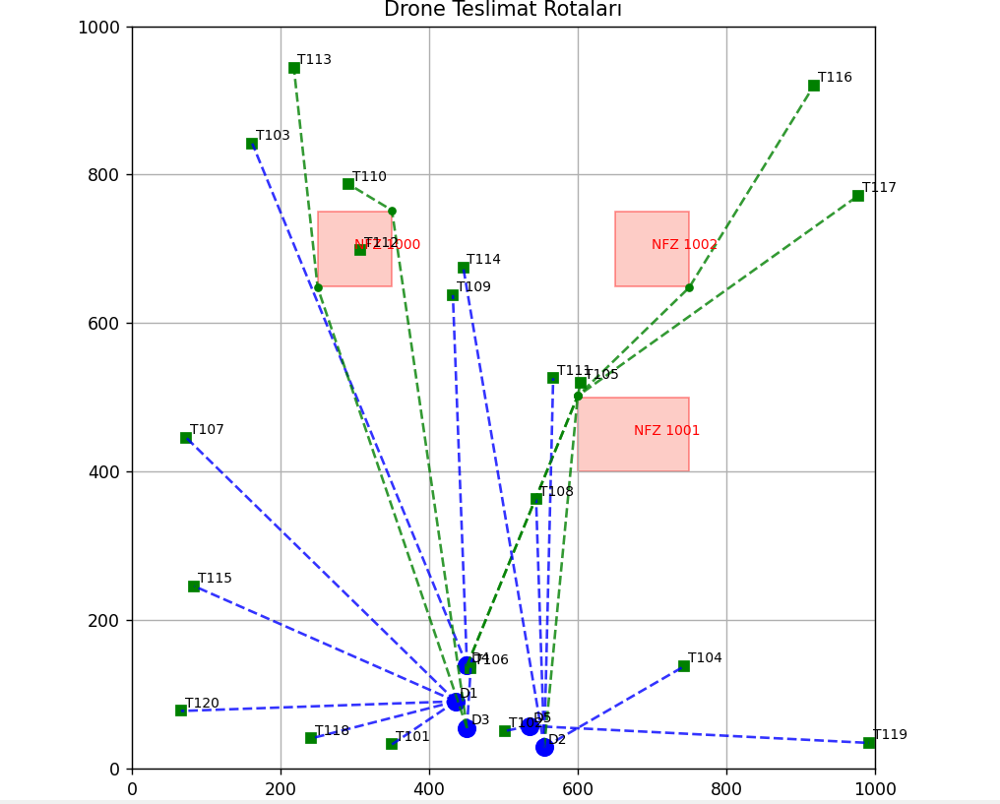
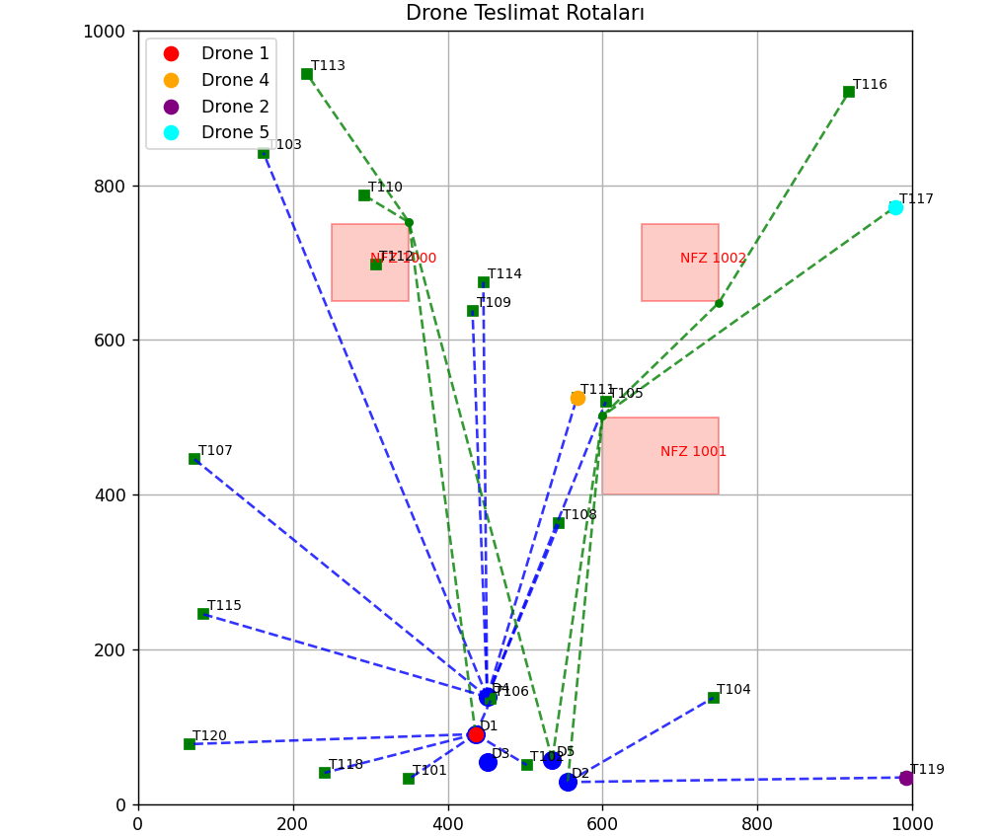
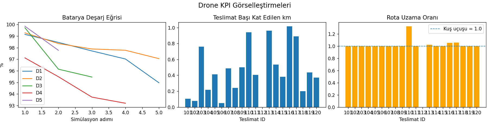

## Otonom Drone Filo Optimizasyonu Sistemi
**Otonom Drone Filo Optimizasyonu Sistemi**, lojistik sektörünün "son kilometre" teslimat süreçlerini iyileştirmek amacıyla geliştirilmiş, çok kriterli rota ve görev atama sorunlarına çözüm sunan bir yazılımdır. Sistem, çeşitli kısıtlar ve öncelikler arasında optimal sonuçlar elde etmek için CSP, Genetik Algoritma (GA) ve A* algoritmalarını bir arada kullanır.

## 🚀 Proje Amacı
Drone filolarının teslimat süreçlerindeki karmaşık problemleri çözerek sistemi daha **verimli**, **güvenli** ve **ölçeklenebilir** hale getirmeyi hedefliyoruz. Bu kapsamda;
- Teslimat öncelikleri,
- Batarya limitleri,
- Yük kapasiteleri,
- Dinamik Yasak Uçuş Bölgeleri (YUB)  
gibi önemli operasyonel parametreler dikkate alınmaktadır.

- **Yöntemler:**  
  - *Constraint Satisfaction Problem (CSP)*: Ön atama için.
  - *Genetik Algoritma (GA)*: Küresel optimizasyon.
  - *A* Algoritması*: Mikro düzeyde rota düzeltmesi.  

 
## ✨ Ana Özellikler
- **Kapsamlı Optimizasyon Süreci:**  
  - CSP ile başlangıç ataması,  
  - Genetik Algoritma ile global iyileştirme,  
  - A* algoritmasıyla güvenli rota planlama.
- **Gelişmiş Veri Görselleştirme:**  
  Batarya kullanımı, teslimat mesafeleri, ihlal oranları gibi performans metrikleri KPI panellerinde izlenebilir.  
- **Yüksek Başarımlı Hesaplama:**  
  Paralel GPU desteği ile büyük boyutlu çözümler saniyeler içinde hesaplanır.
- **Dinamik Yasak Uçuş Bölgeleri (YUB):**  
  Rotalar, anlık değişen kurallara otomatik olarak uyum sağlar.

## Görseller

  
  

 

  

  
